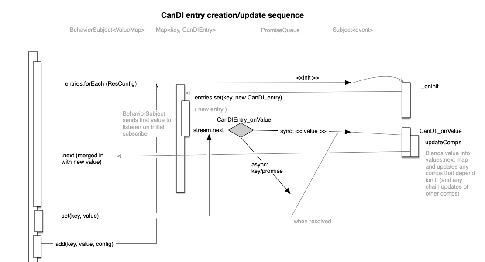

# [Can-di-land](https://www.npmjs.com/package/@wonderlandlabs/can-di-land)

This module creates a registry of content that used dependency injection(di) rules
to enforce dependency rules. Its purpose is to define systems with multiple -- potential nested -- 
dependencies, to ensure that all required configurations are in place.

It also allows you to distribute and share dependencies across multiple systems, and to enforce
business logic. For instance, some entries may be re-definable; some you may want to "lock in"
and never change once they are resolved. 

Dependency Injection is prevalent in Angular but absent in React and well -- "not Angular".
I used BottleJS previously but wanted to see if I can "reinvent" it to meet my particular needs.

# The basics of DI

* A computed entry that depends on other entries computes only when all its dependencies are available
* When a computed entries' dependencies change, it is recomputed
* computed entries that depend on other computed entries can trigger a "chain of computation" 
  if their dependent value is changed

CanDI manages this -- AND allows for two interesting wrinkles:

* Async computed values update "eventually"
* Final entries cannot be updated later; final computed entries should compute only once. 
* Functions with dependencies and/or predefined arguments will have one or more parameters "shifted" in front of
  their params every time they are called. 

## Some Behavior of CanDI instances

* An entry is only considered resolved when its dependencies (if any) are all resolved.
  While one or more dependency is undefined, it will not contribute a value to the can.
* Registered entry **values** can be re-set; however their **configuration** cannot be redefined.
* if a entry is configured to be "final" it can only be set once; re-sets will throw errors.
* getAsync(key) is asynchronous; it only resolve when dependencies are resolved. 
  (and therefore, may never resolve)
* get(key) is synchronous; it returns undefined if the entry for key is pending. 
* if maxTime is passed to get(key, maxTime), it will throw if dependencies are not resolved before the time limit.
* it is not an error to call `get(key)` or `has(key)` before the entry key has been defined. 

## A few notes on terminology 

The terminology used here isn't based on any formal or theoretical model;
just observed patterns of key/value usage in the JS community. There are cases where a term has a 
synonym described below in parentheses.

* **Entry** (a.k.a. "entity") A collective term for everything keyed off a single key; 
  this includes the key, the resource and the value
* **Key** (a.k.a. "key") A unique value used to identify a single Entry. /
  In general, keys are strings; but as they are used throughout as Map instance keys, 
  practically any JS token can be used as a key. 
* **Resource** The resource is "that which produces the value associated with a key." 
  For Value type entries, an entries' resource _is_ its value. For 'func'/'comp' entries, 
  they are the _basis_ for an entries' value. 
* **Value** The _expression_ of an entries' resource. e.g., the computted entries' function's output.
* **Type** the variation of how an entry expresses its value based on its resource. 
  currently the type options are 'value', 'func' and 'comp'.
* **config** (a.k.a. configuration) The behavioral modifiers that affect how a resource is transmuted into
  a value, including how often / if its resource can be updated, injected args for function-based
  entries, and whether it is asynchronous. Configuration _must_ include type, but all other fields
  in a configuration are optional. 
  Configuration is stored internally as a POJO meeting the type requirements detailed in `type.ts`.
* **Resolved** (antonym: pending) An entry is resolved when it's value has been computed (at least once). 
  Async 'func' / 'comp' entries are resolved when its promise completes (for the first time). 
  Even if its resource is updated later on, it is considered "resolved" and presents its former value 
  until the next promise resolution. (I.e., when an entry resolves, it stays resolved,
  even if its resource/value changes). 
* **Registered** (a.k.a. defined) entries have a defined configuration paired with a given key. 
  (and usually, it also has a resource as well.)
  Resolved entries are by definition Registered, but not necessarily the other way around. 

## Resource types and configuration

The first time a value is set, it must have a configuration:

```javascript
import { CanDI } from '@wonderlandlabs/can-di-land';

(async () => {
  const can = new CanDI();
  can.add('foo', 100, { type: 'value' });
  // NOT awaited
  can.getAsync('sum-of-foo-and-vey').then((value) => {
    console.log('the sum is ', value)
  });
  can.add('sum-of-foo-and-vey', (foo: number, vey: number) => {
    return foo + vey
  }, { type: 'comp', deps: ['foo', 'vey'] })
  can.add('vey', -20, { type: 'value' });
  can.set('vey', 300);
  setTimeout(() => {
    can.set('foo', 200);
  }, 50)
  await new Promise((done) => setTimeout(done, 100));
  can.getAsync('sum-of-foo-and-vey').then((value) => console.log('after 100 ms, the sum is ', value))
})();
/**
 * the sum is  400
 * after 100 ms, the sum is  500
 */
```

A few things to call out:

1. 'sum-of-foo-and-vey' is "got" before it has been defined. This _is allowed._
2. 'sum-of-foo-and-vey' is a 'comp' (resolved) value; it's value is the result of executing the defining function. 
   It also has dependencies (deps) defined, so it awaits _their_ resolution. 
3. the dependencies of the configuration of 'sum-of-foo-and-vey' are injected in the order they appear in the config;
4. the dependencies of 'sum-of-foo-and-vey' have not been defined when it is added
5. vey is set twice -- synchronously -- but the async resolution of vey accepts the second value.
6. the final set of 'vey' triggers the execution of the `getAsync()`'s 'then' clause.
7. An async set of foo to 200 is too late to be considered by the "get" computation, for the _first_ get.
8. However, it the change of foo _does_ happen before the _final_ get, as shown in the console output.

Also, the result of a computation is cached; so it will be referentially consistent as long as the inputs
are not changed.

## resource types:

There are three types of resources:

### **values**: `value`

Value resources have no dependencies, by definition.
They can be of any things - Arrays, Dom Objects, streams, functions, Class definitions, etc.

The value returned from `get` is exactly the value passed in to `set` or `add` (or as initially defined)

### **functions**: `func`

Functions must be javascript Functions. Their dependencies, if any, are curried in front of any arguments.
You can also inject fixed arguments to the function in the configuration. ('args')

### **resolved values**: `comp`

Computed values are defined by a function that derives a value from their dependencies.
The resource is in fact a "Factory" for the returned value.
The factory computes based on the dependencies, and its value is updated every time a dependency changes.

## Configurations

The only mandatory field in a resource's configuration is type. You can in fact pass a type string instead of
a config and it will interpret it correctly. All of these are valid calls:

```javascript

const can = new CanD_oldI();
can.add('foo', 100);
can.add('bar', { type: 'value' });
can.add('foo2', 100, 'value');
can.add('bar2', () => 400, 'comp');
can.add('vey', () => 400, 'func');
```

Here are the possible (optional) configurations you can pass in:

* `final` (boolean) :: default: false; the resource cannot be changed
* `async`: has a range of implications depending on the type
* `type` (see above)  'func'| 'comp' | 'value' (string) :: default: 'value'
* `deps`  any[]. default []; the other entries that must be resolved for this entry to be considered resolved.
* `args` any[] :: default []; Additional arguments that are curried in front of the arguments to 'comp' or 'func'
  entries.

As mentioned before only type is a required parameter.

## Setting a resource multiple times.

You can redefine (`set(key, value)`) an entry as many times as you want -- unless the value is `final`.
Redefining 'comp' or 'func' values is possible and will clear the cache.

## Removing an entry

There is no way to delete an entry. The design of CanDI is as an upserting key/value store;
once added an entry can be changed but never removed. 
Because of the dependency network that CanDI creates, once keys are resolved 
they are considered eligible to provide values, for the lifetime of the CanDI instance. 
Removing and un-registering a value would create complex, unreliable side effects 
for the entries they support.

Which is also to say, do not modify the entries collection directly or delete its keys. 

## Resource keys

In this example and the tests, all resources have string keys; this is a pretty common assumption.
It is the best and simplest way to register values ina `CanDI`. (take care with blank spaces and casing of course.)

However, it is not a *requirement* that entries are keyed with strings.
You can in fact use numbers, symbols, dom objects or any valid key to a javascript `Map` instance
to key your values in a `CanDI`. Just make sure you understand the keying implications
of the Map class when it comes to key uniqueness.

note: it's not a good idea to use arrays as keys; many methods interpret arrays as being collections of multiple keys.

## Entries, resources and values.

an Entry is a definition that is paired with a specific key. When you call `myCan.add(key, resource, config?)`
you define an entry for that key, which is stored in the `entries` Map property.

The second argument to `myCan.add(key, resource, config?)` is called a `resource`. It is stored in
`myCan.registry.get(key).resource`.

The *value* of a registered item is returned by `myCan.get(mame)` -- a synchronous function.

* For `value` types, the resource and the value are in fact identical (and referentially identical), to what is returned
  from `get(key)`.
* For `comp` (factory) types, it is a function _that produces the value_, which you retrieve from `myCan.get(key)`.
* For `func` types it is decorated with a secondary functional wrapper to include any derived values.

### Pending, undefined, defined and resolved entries

Entries that have not been defined -- or defined entries with undefined/pending dependencies -- 
are considered "Pending"; they are undefined when `myComp.get(key)` is called, a
nd will delay completion of `myCan.get(key)` until they are resolved. 

Entries that have been defined, and have pending/undefined dependencies, are considered "pending";
they are present in the registry but will hold up `get(key)` Promise resolution. 

An entry is considered **resolved** (and not **pending**) if:

* it has been defined
* all its dependencies have been resolved

'value' type entries are always resolved once they are defined. 

Note that for `pending` comp or func entries 
-- entries whose listed dependencies are not resolved --
will always return undefined. from `myConp.get(funcName)`. 

An entry is **defined** when its parameters have been `set(key...)`. 
It will have an entry in the `myComp.registry` Map, 
but may be pending if their dependencies are not resolved. 

## async `myCan.getAsync(key)`

The getAsync method is async; it completes when all the required dependencies have been defined.
For values, which by definition cannot have dependencies, it returns as soon as the entry is defined.

You can call `myCan.getWhen(key)` before an entry is defined.
It will error ('time out') in the next execution cycle if the entry has not been defined at that time.

that is -- get will retrieve an entry value if

* it has no dependencies or
* its dependencies are defined 

## sync `myCan.get(key)`

value is immediate; it returns undefined unless the entry _and its dependencies(if any)_ are defined
before `.get()` is called.

## async `myCan.when([key, key2, ...keyN] | key, once = true)` : Subject

`when(key)` accepts a single key, or an array of keys. it returns a subject that emits when
all the listed dependencies (and _their_ dependencies) are defined, or throws when the maxTime elapses.
It is used internally by `.getAsync()` but can be used to delay any sort of activity until
a set of dependencies resolves.

It accepts a single entry key or an array of entry keys.

Usually you want the stream to be "promisy" -- it should emit a single value then conclude.
If you want to be notified every time a key (or keys) are changed, 

## sync `myCan.has(key | [key])`

returns true if the entry and its dependencies (if any) are _currently_ defined/resolved.

## Dependencies (deps)

'func' and 'comp' entries can have dependencies; this is the "D" in DI, and the reason this module was designed for.
Dependencies are an array of keys passed in through configuration for a specific entry. 

'func' entries' dependencies are used as curried arguments to the function that defines them (see above). 
'comp' entries inject their dependencies; every time their dependencies change, a comp entry is recomputed. 
Comp entries do not compute until all their dependencies are resolved/available. 

'value' entries do not have deps, and it is considered an error to attempt to try to add deps to a value type. 

### Dependency loops

You can potentially create computation loops by crating comp entries that list each other in their deps config;
this is checked for in the CanDiEntry constructor, and if a loop is detected, will throw, blocking the entry from
being added to the CanDI entries map. Even indirect dependency should be detected; that being said, when you create
dependencies, especially when comps depend on other comps, keep an eye out for loops.

## Injected arguments/dependencies to 'comp' and 'func' entries

Several parameters may be prepended to calls on a function-based entry:

* first, the dependencies (deps) in the config are appended. (by definition, they must be resolved before the function
  is every called / available)
* second, if any other arguments are provided in the configuration, they are appended.
* Lastly, if any parameters are passed into the function (for a 'func' entry) they are passed in.

here are some examples of config parameters being "pushed in front" of calling parameters:

```javascript

function point3(x: number, y: number, z: number) {
  return ({ x, y, z });
}

const can = new CanD_oldI();
can.add('point', point3, 'func');
console.log(con.get('point')(1, 2, 3));
//  {x: 1, y: 2, z: 3}
can.add('pointA', point3, { type: 'func', args: [100] });
console.log(con.get('pointA')(1, 2, 3));
// {x: 100, y: 1, z: 2}
can.set('pointDA', point3, { type: 'func', deps: ['x'], args: [100] });
can.add('x', 200);

const p3 = con.get('pointDA');
console.log(p3(1, 2, 3));
// { x: 200, y: 100, z: 1 }

can.set('x', 400);
console.log(p3(1, 2, 3));
// { x: 400, y: 100, z: 1 }
```
Because there is no rule against calling a function with more parameters than it is equipped to accept,
some parameters of the call are not present in the output point. 

Parameters are injected in "Dap Order" -- first dependencies, then arguments, then called parameters. 
note- 'comp' type entries never have any parameters, just deps and args. 

Functional dependency happens inside closure; so the function reference taken from a CanDI will take in different
values and (probably) output a different value if the CanDI's dependent entries change between calls. 

## Entry types / TypeScript

There is at this point no type restraints on entries, except the resource for a 
'comp' | 'func' entry be a javascript function.

## Async and resolved values

if the configuration `async` is set, it has different effects on different data types. 

* async `value` types are assumed to be set as a Promise. the value is not "resolved" 
  until the promise resolves. 
* async `func` types aren't treated any different from sync `func` types - the output of the 
  function may be async but that is not factored into any consideration of the can code. 
* async `comp` types' values are extracted from the promise when recorded as the entries' value. 
  
_If the dependencies change before the promise resolves your comp's resolution may be preempted._

Note - even if a final async entries' value has not been resolved, it cannot be updated during the period 
in which the promise is pending; it is still marked as having been "sent."

## `final` 

final entries' resource can never be changed. For `value` and `func` entries, this is the only
thing that matters. However -- for `comp` values there is another wrinkle: the factory function
will only respond to the first complete set of dependencies; it will not re-compute if the dependencies are changed.
the context here is that final values are trusted to be either undefined (umresolved) or one _unchanging_
value. 

for instance, a `comp` value that depends on final values is, de facto, going to be final itself.
(it will compute once as its dependencies can never change)

## binding / "this"

Because of the way CanDI operates, you can't really expect the reference to "this" to survive decoration;
it's best to either (a) inject your target "this" value as an args member or (b) assign `const self = this`
and use it as a 'closured' reference. 

## sequence of function execution

Sometimes it's very important to know _when_ an entries' function is going to be called. 

* any function that is set as a 'value' type will never get called by CanDI.
* a 'comp' function with no dependencies will get called as soon as it is defined (with `add()` or in the constructor);
* a 'comp' function with dependencies will get called as soon as its dependencies are resolved. 

* a 'func' function is never called by its containing CanDI instance; it may be returned (inside a decorator function) 
  but it will never actually be _called_ until you call it (or its decorator, calling it indirectly)

## Continuous observation

99% of the time you want to get the value when it is ready and be done -- a la `getAsync(keys)`. 
However sometimes you want to watch a value change over time. `when(key(s), false)` returns an RxJS 
Observable; the false enables continuous observation 
to be reported to its [subscribers](https://rxjs.dev/guide/observer). it is used internally by `getAsync(keys)`.

# Under the hood



There are a lot of interacting mandates in Can-Di-land

* 'final' entries must not emit more than once
* 'async' entries that are 'comp' and 'final' emit "eventually"
* 'comp' entries update when their dependencies update
* 'func' entries inject their dependencies into their output on each call

Each of these alone require significant investment and cognition. This library had four or so reinventions until 
the current model was settled upon. Initially I tried a "one big stream" approach but it proved too complex and 
difficult to parse. 

The current model relies on an intelligent subcomponent, "CanDiEntry," that stores the config and a BehaviorSubject
containing the resource. It handles parameter injection for function-based entries, and 'final' throttling. 

Entries' values are pushed, via subscription, into a collection, `CanDI.values`, 
a BehaviorSubject emitting a map of values. 
Only values of entries with resolved (or no) dependencies are injected into the values subject. 

The CanDiEntry subscriber triggers an event that merges its' individual value
into the values subject; but before it does so, it triggers any 'comp' entries 
that depend on it (and any 'comp' entries that depend on _those_ entries, etc.). 
updating the map entry synchronously before it is `.next(map)` streamed to the 
values subject. 

One exception is that async values are not sent directly to the values subject;
they are kept in the PromiseQueue (pq) until they resolve. The PromiseQueue is 
a 'debounce based' system; any promises that are sent to it while another promise
for the same key has not resolved yet are "cancelled". 

Since you can't actually cancel a promise, values pushed into the PQ are converted to streams. 
"Debounced" promises are `.complete()`d before they emit, masking their result from the submission.
A completed promise's value is sent as a 'value' event to the CanDI, 
which is what would have happened synchronously if the value has not been async. 

## This may seem like "a lot."

But the prospect of combining DI with asynchronous values _and_ throttling specific values
from being updated/resubmitted turned out to be trickier than you'd like it to be. 
On top of that the possibility of cascading comps required some investment to come up with a 
parseable system of resolution.

## A final note 

CanDI is not intended to be a long term state system; it is intended to allow you to share dependency across resources,
and the assumption is that most dependencies will not change that often, and that the resources expressed by a CanDI
instance will eventually 'settle' and be rapidly accessible. 

The ambition of CanDI is to ensure that 
_resources are only expressed once they have been provided all the input they need to compute._ Also, "provided" means
that any async dependencies are resolved. 

For instance, as async values "debounce," creating an
async comp whose dependencies rapidly change can create a spike in computation and a lot of discarded results that is 
probably not a good thing for your applications' performance. 
